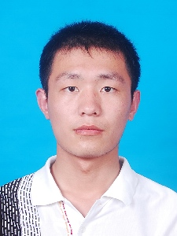

<h1>个人简历</h1>

<table style="width:100%;">
	<tr>
		<td>姓名</td>
		<td>马新成</td>
		<td>性别</td>
		<td>男</td>
	</tr>
	<tr>
		<td>民族</td>
		<td>汉族</td>
		<td>政治面貌</td>
		<td>中共党员</td>
	</tr>
	<tr>
		<td>籍贯</td>
		<td>河北沧州</td>
		<td>出生年月</td>
		<td>1989-03</td>
	</tr>
	<tr>
		<td>邮箱</td>
		<td><a href="mailto:maxincheng_bfs@126.com" title="mail to me">maxincheng_bfs@126.com</a></td>
		<td>联系方式</td>
		<td>18813046203</td>
	<tr>
</table>

## 教育背景

<table style="width:100%">
	<tr>
		<td style="border:0px">2013.09-至今</td>
		<td style="border:0px">硕士</td>
		<td style="border:0px">信息安全与对抗专业</td>
		<td style="border:0px">信息与电子学院</td>
		<td style="border:0px">北京理工大学</td>
	</tr>
	<tr>
		<td style="border:0px">2009.09-2013.06</td>
		<td style="border:0px">学士</td>
		<td style="border:0px">通信工程</td>
		<td style="border:0px">信息科学与工程学院</td>
		<td style="border:0px">河北科技大学</td>
	</tr>
</table>
## 综合技能

【<strong>熟练的语言</strong>】：脚本语言包括R，Matlab，PHP，编译语言包括C/C++，JAVA等。  
【<strong>专向能力</strong>】：
<ol>
	<li>数据挖掘分析能力</li>  
熟练R语言进行数据挖掘分析，熟悉神经网络，半监督聚类算法，了解粒子群，蚁群，遗传算法等参数优化算法。
	<li>Web开发能力</li>
语言包括HTML5，CSS3，Javascript（jQuery），页面渲染框架Bootstrap，开发环境LAMP和windows+eclipse+tomcat。 
	<li>安卓应用开发</li>
熟悉Android应用开发环境eclipse+SDK+ADT。
</ol>
【<strong>熟练算法</strong>】：神经网络，半监督聚类。
【<strong>熟悉工具</strong>】：eclipse，Rstudio，Matlab
【<strong>英语水平</strong>】：CET-6，能够熟练查找、阅读英文技术文档。

## 主要项目经历

	

		

		实时变声播放系统
		

		

		2014.02-2014.05
		

	

	

		
【<strong>项目描述</strong>】实现实时变声，采用的方式是采集原声，在音频流格式对数据处理，并以音频流输出。

		
【<strong>开发环境</strong>】PC：vs2010. 安卓：eclipse+SDK+ADT

		
【<strong>本人工作</strong>】本人在该项目中负责整体结构设计和项目具体实施。
			<ol style="margin:0px;">
				<li>整理系统开发需求及完成系统设计。</li>
				<li>分析soundtouch开源音频处理算法，修改代码为音频流处理方式。利用audiotrack接口完成音频流采集及播放。</li>
			</ol>
		

	

	

		

		网络安全策略预演管理平台
		

		

		2014.09-2015.12
		

	

	

		
【<strong>项目描述</strong>】管理多子网络之间的安全等级策略，及动态调整。

		
【<strong>开发环境</strong>】windos+Dreamweaver

		
【<strong>本人工作</strong>】本人在该项目中负责以boostrap+jquery框架下完成前端展示。
			<ol style="margin:0px;">
				<li>作为参与人主要进行了前端展示框架结构及css修改。</li>
				<li>主要负责通过和服务端数据的前端展示。</li>
			</ol>
		

	

	

		

		安卓流量及网络行为监控系统
		

		

		2014.05-2015.08
		

	

	

		
【<strong>项目描述</strong>】软件实时监控安卓客户端的网络浏览行为及总体流量监控并记录

		
【<strong>开发环境</strong>】操作系统windows，工具eclipse+SDK+ADT。

		
【<strong>本人工作</strong>】本人在该项目中负责整体结构设计和项目具体实施。
			<ol style="margin:0px;">
				<li>作为项目组负责人，负责整体项目整体结构、模块划分及模块接口设计。</li>
				<li>负责模块功能实现，和数据存储实现。</li>
			</ol>
		

	

	

		

		基于单片机的远程温度监控系统
		

		

		2010.12-2011.03
		

	

	

		
【<strong>项目描述</strong>】此项目为河北科技大学大学生科技创新项目，主要完成地窖等人员参与受限地区的温度监控。主要涉及芯片操作有：单片机AT89C52、温度传感器DS18B20、无线射频芯片nRF24L01、液晶显示器LCD1602

		
【<strong>开发环境</strong>】操作系统Windows，工具：keil 3 + STC-ISP.exe

		
【<strong>本人工作</strong>】完成系统设计及实现
			<ol style="margin:0px;">
				<li>作为项目组负责人，负责整体项目整体结构、模块划分及模块接口设计</li>
				<li>工作分配个人完成软件编写及调试，其他人完成硬件设计及制板。</li>
			</ol>
		

	

##   社会实践

	

		

		【<strong>团组织活动</strong>】组织班级共青团班级支部的多次社会志愿活动（南焦客运站服务，贾村小学等）
		

		

		2010-2012
		

	

	

		

		【<strong>班级文化</strong>】组织班级多次文化娱乐活动(跨班级联谊（含体育活动、娱乐联欢）、首都北京之行等)
		

		

		2010-2012
		

	

	

		

		【<strong>实验室文化</strong>】组织实验室秦皇岛两日游
		

		

		2014.06
		

	

## 获奖荣誉

	

		

		【<strong>国家</strong>】2011年国家励志奖学金
		

		

		2011.10
		

	

	

		

		【<strong>省级</strong>】第八届“挑战杯”首都大学生课外学术科技作品竞赛一等奖
		

		

		2015.06
		

	

	

		

		【<strong>学校</strong>】河北科技大学校级奖学金（年度评奖）：二等奖2次，一等奖1次。
		

		

		2010-2012
		

	

	

		

		【<strong>学校</strong>】河北科技大学三好学生、优秀团员
		

		

		2012.09
		

	

	

		

		【<strong>企业</strong>】2011 年华润助学金
		

		

		2011.11
		

	

## 个人评价
【<strong>个人特点</strong>】吃苦耐劳坚持执着难言放弃，思维活跃勇于创新敢想敢做，拥有快速学习与系统思维能力。 
【<strong>工作能力</strong>】踏实肯干，认真负责，遇事沉着冷静，处事果断；极具组织协调能力、活动策划能力和公关能力突出，团队协作能力优秀。  
【<strong>生活态度</strong>】积极乐观、善于沟通，诚信友善，乐于助人

<h3>十分感谢您在百忙中阅读我的简历！</h3>
&copy; leisurely ~ <a href="http://leisurely.github.io" title="ICU">Find Me Here</a>

